# Complete Multimodal Capture Application Architecture

## Overview
This document provides a comprehensive architectural diagram of the entire multimodal capture application, including all components, data pipelines, and processing steps across both Android and PC platforms.

## Complete System Architecture

```mermaid
graph TB
    subgraph "Hardware Layer"
        TC[TC001 Thermal Camera<br/>- USB-C Connection<br/>- 256x192 Resolution<br/>- 16-bit Thermal Data]
        GSR[Shimmer3 GSR+ Sensor<br/>- Bluetooth Connection<br/>- Real-time GSR Data<br/>- Heart Rate Monitoring]
        CAM[Android Camera<br/>- Camera2 API<br/>- RGB Video Capture<br/>- Multiple Camera Support]
        MIC[Microphone<br/>- Audio Recording<br/>- Synchronized Capture]
        USB[USB Devices<br/>- Device Detection<br/>- Permission Management]
        BT[Bluetooth Devices<br/>- Device Discovery<br/>- Connection Management]
    end
    
    subgraph "Android Application"
        subgraph "UI Layer"
            MA[MainActivity<br/>- Main Entry Point<br/>- Permission Management<br/>- Service Coordination]
            PA[PreviewActivity<br/>- Multi-Camera Preview<br/>- Real-time Display]
            SA[SettingsActivity<br/>- Configuration Management<br/>- Export Settings]
            GRA[GSRGraphActivity<br/>- Real-time GSR Visualization<br/>- Time Range Filtering]
            SFA[SessionFolderActivity<br/>- Session Management<br/>- File Browsing]
            
            subgraph "Fragments"
                MCF[MainCaptureFragment<br/>- Recording Controls<br/>- Status Display]
                DMF[DeviceManagementFragment<br/>- Device Connection<br/>- Status Monitoring]
                SEF[SettingsExportFragment<br/>- Data Export<br/>- Configuration Export]
            end
            
            subgraph "UI Components"
                TPV[ThermalPreviewView<br/>- Enhanced Thermal Display<br/>- Temperature Measurement<br/>- Pseudocolor Palettes]
                CNV[CustomNavigationView<br/>- Tab Navigation<br/>- Fragment Management]
            end
        end
        
        subgraph "ViewModel Layer"
            MVM[MainViewModel<br/>- Application State<br/>- Module Coordination<br/>- LiveData Management]
            PVM[PreviewViewModel<br/>- Multi-Camera Management<br/>- Preview Coordination]
        end
        
        subgraph "Service Layer"
            RS[RecordingService<br/>- Background Recording<br/>- Foreground Service<br/>- Notification Management]
            NS[NetworkService<br/>- Background Networking<br/>- PC Communication<br/>- Discovery Service]
        end
        
        subgraph "Capture Managers"
            TCM[ThermalCameraManager<br/>- TC001 Integration<br/>- USB Communication<br/>- Frame Processing]
            GSM[GSRSensorManager<br/>- Shimmer SDK Integration<br/>- Real-time Data Streaming<br/>- Bluetooth Communication]
            CM[CameraManager<br/>- Camera2 API<br/>- Video Recording<br/>- Preview Management]
            ARM[AudioRecorderManager<br/>- Microphone Capture<br/>- Audio Processing<br/>- File Output]
        end
        
        subgraph "Processing Managers"
            NM[NetworkManager<br/>- PC Communication<br/>- Data Transmission<br/>- Time Synchronization]
            DEM[DataExportManager<br/>- Multi-format Export<br/>- Data Aggregation<br/>- Analysis Pipeline]
            LSM[LSLStreamManager<br/>- Lab Streaming Layer<br/>- Real-time Streaming<br/>- External Integration]
        end
        
        subgraph "Utility Managers"
            TM[TimestampManager<br/>- Unified Timestamping<br/>- Session Coordination]
            SM[SettingsManager<br/>- Configuration Persistence<br/>- Device Settings]
            PM[PermissionManager<br/>- Runtime Permissions<br/>- Security Management]
            SFM[SessionFolderManager<br/>- File Organization<br/>- Session Management]
            LM[LoggingManager<br/>- Comprehensive Logging<br/>- Error Reporting]
            UMM[USBMonitorManager<br/>- USB Device Management<br/>- Hardware Integration]
        end
        
        subgraph "Data Storage"
            LS[Local Storage<br/>- Session Files<br/>- Raw Data<br/>- Metadata]
            CS[Configuration Storage<br/>- Settings<br/>- Preferences<br/>- Device Configs]
        end
    end
    
    subgraph "PC Controller System"
        subgraph "Core Components"
            DM[DeviceManager<br/>- Multi-device Coordination<br/>- Connection Management<br/>- Status Monitoring]
            TS[TimeSynchronizer<br/>- Cross-device Sync<br/>- Clock Calibration<br/>- Latency Compensation]
            SEM[SyncEventManager<br/>- Event Coordination<br/>- Trigger Management<br/>- Timeline Sync]
            RC[RecordingController<br/>- Session Management<br/>- Recording Coordination<br/>- State Management]
        end
        
        subgraph "Data Processing"
            SMG[SessionManifestGenerator<br/>- Metadata Generation<br/>- Session Documentation<br/>- File Cataloging]
            FA[FileAggregator<br/>- Multi-source Data<br/>- File Consolidation<br/>- Format Standardization]
            DV[DataValidator<br/>- Quality Assurance<br/>- Integrity Checking<br/>- Error Detection]
            DE[DataExporter<br/>- Multi-format Export<br/>- Analysis Pipeline<br/>- Report Generation]
        end
        
        subgraph "Analytics & Monitoring"
            PA[PerformanceAnalytics<br/>- System Metrics<br/>- Performance Monitoring<br/>- Optimization Analysis]
            MD[MonitoringDashboard<br/>- Real-time Visualization<br/>- System Status<br/>- Alert Management]
        end
        
        subgraph "Integration Layer"
            LSLM[LSLManager<br/>- Lab Streaming Layer<br/>- Real-time Streaming<br/>- External Tool Integration]
            SB[ShimmerBridge<br/>- Java-Python Bridge<br/>- GSR Data Processing<br/>- Cross-platform Communication]
        end
        
        subgraph "Testing & Validation"
            MDST[MultiDeviceSyncTester<br/>- Synchronization Testing<br/>- Latency Analysis<br/>- Quality Validation]
            SC[SyncCalibrator<br/>- Calibration Utilities<br/>- Timing Adjustment<br/>- Precision Tuning]
            SV[SystemValidator<br/>- End-to-end Testing<br/>- System Verification<br/>- Performance Validation]
        end
        
        subgraph "PC Data Storage"
            PDS[PC Data Storage<br/>- Aggregated Sessions<br/>- Processed Data<br/>- Analysis Results]
            ADS[Analysis Database<br/>- Processed Metrics<br/>- Historical Data<br/>- Performance Records]
        end
    end
    
    subgraph "External Systems"
        LSL[Lab Streaming Layer<br/>- Real-time Data Streaming<br/>- External Tool Integration]
        EXT[External Analysis Tools<br/>- MATLAB/Python Scripts<br/>- Research Platforms<br/>- Visualization Tools]
    end
    
    %% Hardware to Capture Managers
    TC --> TCM
    GSR --> GSM
    CAM --> CM
    MIC --> ARM
    USB --> UMM
    BT --> GSM
    
    %% Capture Managers to ViewModels
    TCM --> MVM
    GSM --> MVM
    CM --> MVM
    ARM --> MVM
    TCM --> PVM
    CM --> PVM
    
    %% ViewModels to UI
    MVM --> MA
    MVM --> MCF
    MVM --> DMF
    MVM --> SEF
    PVM --> PA
    
    %% UI Components
    MA --> MCF
    MA --> DMF
    MA --> SEF
    PA --> TPV
    
    %% Services Integration
    MVM --> RS
    MVM --> NS
    RS --> LS
    NS --> NM
    
    %% Processing Managers
    TCM --> DEM
    GSM --> DEM
    CM --> DEM
    ARM --> DEM
    NM --> DEM
    DEM --> LSM
    
    %% Utility Managers
    TM --> TCM
    TM --> GSM
    TM --> CM
    TM --> ARM
    SM --> MVM
    PM --> MA
    SFM --> SFA
    LM --> MVM
    UMM --> TCM
    
    %% Data Storage
    TCM --> LS
    GSM --> LS
    CM --> LS
    ARM --> LS
    SM --> CS
    
    %% Android to PC Communication
    NM --> DM
    DEM --> FA
    LSM --> LSLM
    
    %% PC Core Processing
    DM --> TS
    DM --> SEM
    DM --> RC
    TS --> SEM
    SEM --> RC
    
    %% PC Data Processing Pipeline
    RC --> SMG
    SMG --> FA
    FA --> DV
    DV --> DE
    DE --> PDS
    
    %% PC Analytics
    DM --> PA
    TS --> PA
    PA --> MD
    MD --> ADS
    
    %% PC Integration
    LSLM --> LSL
    SB --> GSM
    
    %% PC Testing
    MDST --> SC
    SC --> SV
    SV --> PA
    
    %% External Integration
    LSL --> EXT
    DE --> EXT
    PDS --> EXT
    
    %% Data Flow Styling
    style TC fill:#ffebee
    style GSR fill:#ffebee
    style CAM fill:#ffebee
    style MIC fill:#ffebee
    
    style MVM fill:#e3f2fd
    style PVM fill:#e3f2fd
    
    style TCM fill:#e8f5e8
    style GSM fill:#e8f5e8
    style CM fill:#e8f5e8
    style ARM fill:#e8f5e8
    
    style NM fill:#fff3e0
    style DEM fill:#fff3e0
    style LSM fill:#fff3e0
    
    style DM fill:#f3e5f5
    style TS fill:#f3e5f5
    style SEM fill:#f3e5f5
    style RC fill:#f3e5f5
    
    style PA fill:#fce4ec
    style MD fill:#fce4ec
```



## Data Pipeline Descriptions

### 1. Thermal Camera Pipeline
```
TC001 Hardware → USBMonitorManager → ThermalCameraManager → 
Frame Processing → ThermalPreviewView → MainViewModel → 
RecordingService → Local Storage → NetworkManager → 
PC DeviceManager → FileAggregator → DataValidator → 
DataExporter → Analysis Tools
```

**Processing Steps:**
1. **Data Acquisition**: TC001 provides 16-bit thermal frames via USB-C
2. **Hardware Management**: USBMonitorManager handles USB communication
3. **Frame Processing**: ThermalCameraManager processes raw thermal data
4. **Visualization**: ThermalPreviewView applies pseudocolor palettes and temperature measurement
5. **State Management**: MainViewModel coordinates recording state
6. **Background Recording**: RecordingService ensures continuous data capture
7. **Local Storage**: Raw thermal data stored with timestamps
8. **Network Transmission**: NetworkManager sends data to PC
9. **PC Processing**: FileAggregator consolidates multi-device data
10. **Quality Assurance**: DataValidator ensures data integrity
11. **Export**: DataExporter generates analysis-ready formats

### 2. GSR Sensor Pipeline
```
Shimmer3 GSR+ → Bluetooth → GSRSensorManager → 
Real-time Processing → MainViewModel → RecordingService → 
Local Storage → NetworkManager → PC DeviceManager → 
ShimmerBridge → FileAggregator → DataValidator → 
DataExporter → Analysis Tools
```

**Processing Steps:**
1. **Data Acquisition**: Shimmer3 GSR+ streams real-time physiological data
2. **Bluetooth Communication**: GSRSensorManager handles Shimmer SDK integration
3. **Real-time Processing**: ObjectCluster data extraction and GSR value calculation
4. **State Coordination**: MainViewModel manages recording and display state
5. **Background Recording**: RecordingService ensures continuous data capture
6. **Local Storage**: GSR data stored in CSV format with timestamps
7. **Network Transmission**: NetworkManager sends data to PC
8. **PC Bridge**: ShimmerBridge handles Java-Python communication
9. **Data Aggregation**: FileAggregator consolidates sensor data
10. **Quality Validation**: DataValidator checks data completeness
11. **Export**: DataExporter generates research-ready datasets

### 3. Camera Pipeline
```
Android Camera → Camera2 API → CameraManager → 
Video Processing → PreviewView → PreviewViewModel → 
RecordingService → Local Storage → NetworkManager → 
PC DeviceManager → FileAggregator → DataValidator → 
DataExporter → Analysis Tools
```

**Processing Steps:**
1. **Data Acquisition**: Android cameras provide RGB video streams
2. **Camera Management**: CameraManager handles Camera2 API integration
3. **Video Processing**: Real-time video encoding and frame processing
4. **Preview Display**: PreviewView shows live camera feed
5. **State Management**: PreviewViewModel coordinates multi-camera switching
6. **Background Recording**: RecordingService manages video file output
7. **Local Storage**: Video files stored with synchronized timestamps
8. **Network Transmission**: NetworkManager sends metadata to PC
9. **PC Processing**: FileAggregator handles multi-camera synchronization
10. **Quality Assurance**: DataValidator verifies video integrity
11. **Export**: DataExporter generates analysis-compatible formats

### 4. Audio Pipeline
```
Microphone → AudioRecorderManager → Audio Processing → 
MainViewModel → RecordingService → Local Storage → 
NetworkManager → PC DeviceManager → FileAggregator → 
DataValidator → DataExporter → Analysis Tools
```

**Processing Steps:**
1. **Data Acquisition**: Device microphone captures synchronized audio
2. **Audio Management**: AudioRecorderManager handles recording and processing
3. **Real-time Processing**: Audio encoding and quality management
4. **State Coordination**: MainViewModel manages recording state
5. **Background Recording**: RecordingService ensures continuous capture
6. **Local Storage**: Audio files stored with precise timestamps
7. **Network Transmission**: NetworkManager sends audio metadata to PC
8. **PC Processing**: FileAggregator synchronizes with other data streams
9. **Quality Validation**: DataValidator checks audio integrity
10. **Export**: DataExporter generates research-ready audio formats

### 5. Network Synchronization Pipeline
```
TimestampManager → NetworkManager → PC TimeSynchronizer → 
SyncEventManager → Cross-device Coordination → 
Synchronized Recording → Data Aggregation → 
Quality Validation → Export
```

**Processing Steps:**
1. **Local Timestamping**: TimestampManager provides unified timestamps
2. **Network Coordination**: NetworkManager handles PC communication
3. **Time Synchronization**: PC TimeSynchronizer calibrates device clocks
4. **Event Management**: SyncEventManager coordinates recording events
5. **Cross-device Sync**: Multiple devices synchronized for simultaneous recording
6. **Data Aggregation**: FileAggregator combines synchronized data streams
7. **Quality Assurance**: DataValidator ensures temporal alignment
8. **Export**: DataExporter generates time-aligned datasets

### 6. PC Analytics Pipeline
```
Device Data → PerformanceAnalytics → MonitoringDashboard → 
Real-time Visualization → Alert Management → 
Performance Optimization → System Validation
```

**Processing Steps:**
1. **Data Collection**: PerformanceAnalytics gathers system metrics
2. **Real-time Analysis**: Performance monitoring and trend analysis
3. **Visualization**: MonitoringDashboard provides real-time system status
4. **Alert Management**: Automated alerts for system issues
5. **Optimization**: Performance tuning recommendations
6. **Validation**: SystemValidator ensures optimal operation

## Key Integration Points

### Android-PC Communication
- **NetworkManager ↔ DeviceManager**: Device discovery and connection management
- **DataExportManager ↔ FileAggregator**: Data transmission and aggregation
- **LSLStreamManager ↔ LSLManager**: Real-time streaming integration

### Cross-Platform Synchronization
- **TimestampManager ↔ TimeSynchronizer**: Unified time coordination
- **RecordingService ↔ RecordingController**: Session management
- **Multiple Managers ↔ SyncEventManager**: Event coordination

### External Tool Integration
- **LSLManager ↔ Lab Streaming Layer**: Real-time data streaming
- **DataExporter ↔ External Analysis Tools**: Research platform integration
- **MonitoringDashboard ↔ Visualization Tools**: Real-time monitoring

## Architecture Benefits

1. **Modular Design**: Clear separation of concerns with well-defined interfaces
2. **Scalability**: Easy addition of new sensors and processing modules
3. **Real-time Processing**: Efficient data pipelines for live analysis
4. **Cross-platform Integration**: Seamless Android-PC communication
5. **Quality Assurance**: Multiple validation layers ensure data integrity
6. **Research Ready**: Direct integration with analysis tools and platforms
7. **Performance Monitoring**: Comprehensive system analytics and optimization
8. **Extensibility**: Plugin architecture for custom processing modules

## Data Flow Summary

The application implements a comprehensive multimodal data capture and processing system with the following key characteristics:

- **Hardware Integration**: Direct integration with thermal cameras, GSR sensors, cameras, and microphones
- **Real-time Processing**: Live data processing and visualization across all modalities
- **Synchronized Recording**: Precise temporal alignment of multi-modal data streams
- **Quality Assurance**: Multiple validation layers ensure research-grade data quality
- **Cross-platform Architecture**: Seamless integration between Android capture and PC processing
- **External Integration**: Direct compatibility with research tools and analysis platforms
- **Performance Optimization**: Comprehensive monitoring and optimization capabilities