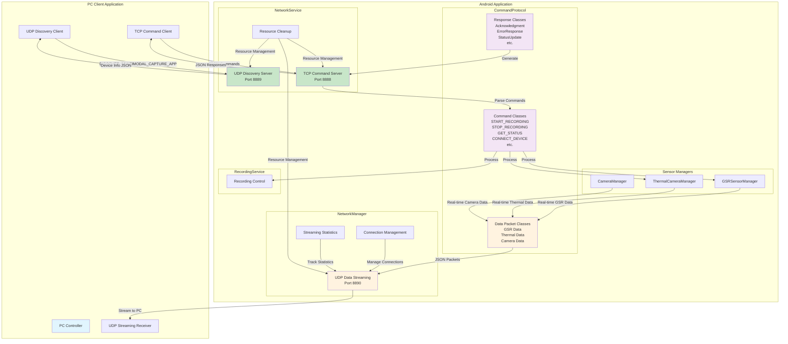
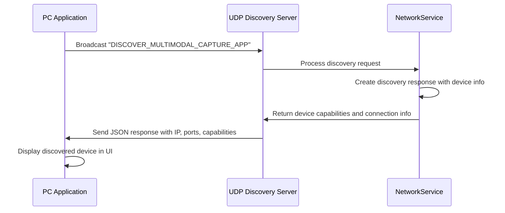
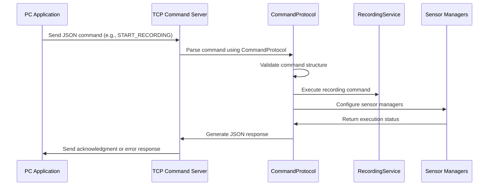
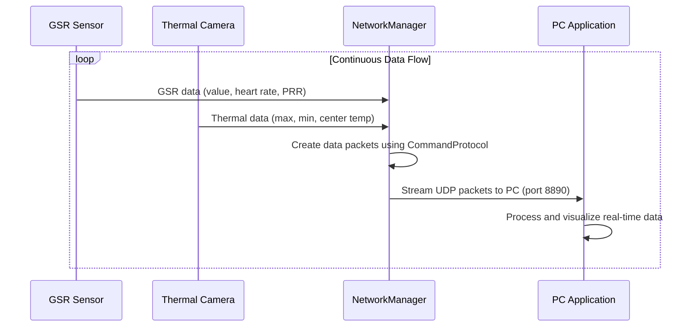

# Networking Architecture Enhancement

## Overview

This document describes the comprehensive Command & Control (C&C) protocol implementation that transforms the basic NetworkService into a robust, production-grade PC communication system with automatic discovery and real-time data streaming capabilities.

## Enhanced Architecture

### Before Enhancement
The original NetworkService had basic functionality but lacked key features for professional PC communication:
- Simple string-based commands
- No automatic discovery
- No real-time data streaming
- Limited error handling

### After Enhancement
The enhanced system provides a complete C&C protocol with:
- Structured JSON-based communication
- UDP automatic discovery
- TCP command server
- Real-time UDP data streaming
- Comprehensive error handling and status reporting

## Architecture Diagram

## Protocol Flow Details

### 1. Device Discovery Flow

### 2. Command Processing Flow

### 3. Real-time Data Streaming Flow

## Key Components

### CommandProtocol.kt
- **Purpose**: Structured JSON communication protocol
- **Features**: Type-safe sealed classes, automatic serialization/deserialization
- **Commands**: START_RECORDING, STOP_RECORDING, GET_STATUS, CONNECT_DEVICE, CONFIGURE_DEVICE, DISCONNECT_ALL_DEVICES, SET_DATA_STREAMING
- **Responses**: Acknowledgment, ErrorResponse, StatusUpdate, DeviceConnected, DeviceDisconnected
- **Data Packets**: GSR, THERMAL_TEMP, CAMERA_FRAME with standardized payload format

### Enhanced NetworkService
- **TCP Command Server**: Handles structured command processing on port 8888
- **UDP Discovery Server**: Enables automatic device discovery on port 8889
- **Thread Management**: Separate threads for each server to ensure non-blocking operation
- **Resource Cleanup**: Comprehensive cleanup of sockets, threads, and connections

### NetworkManager Data Streaming
- **UDP Streaming**: High-frequency data transmission on port 8890
- **Connection Management**: PC address management and connection state tracking
- **Statistics Tracking**: Packet counts, transmission timestamps, and connection metrics
- **Background Processing**: Coroutine-based streaming to avoid blocking sensor data collection

### Sensor Integration
- **GSRSensorManager**: Real-time GSR data streaming with heart rate and packet reception rate
- **ThermalCameraManager**: Live thermal temperature data streaming with max/min/center values
- **Session Tracking**: Automatic session ID inclusion in all data packets for synchronization

## Network Ports

| Port | Protocol | Purpose | Description |
|------|----------|---------|-------------|
| 8888 | TCP | Command Server | Reliable command/response communication |
| 8889 | UDP | Discovery Server | Automatic device discovery broadcasts |
| 8890 | UDP | Data Streaming | High-frequency sensor data transmission |

## Benefits

1. **Automatic Discovery**: PC applications can automatically find Android devices on the network
2. **Structured Communication**: Type-safe JSON protocol eliminates parsing errors
3. **Real-time Data**: Live sensor data streaming for immediate visualization
4. **Scalable Architecture**: Separate channels for commands and data prevent interference
5. **Professional Grade**: Comprehensive error handling, status reporting, and resource management
6. **Background Operation**: Service-based architecture ensures reliable operation even when app is backgrounded

## Future Enhancements

The architecture is designed to support additional features:
- Multiple PC client connections
- Data compression for high-frequency streaming
- Encryption for secure communication
- Quality of Service (QoS) management
- Network bandwidth adaptation
- Cross-platform discovery protocols

## Integration Points

The enhanced networking system integrates seamlessly with:
- **RecordingService**: For coordinated recording control
- **GSRSensorManager**: For real-time GSR data streaming
- **ThermalCameraManager**: For live thermal data transmission
- **SettingsManager**: For network configuration persistence
- **MainActivity**: For UI status updates and user interaction

This comprehensive networking enhancement transforms the application into a professional-grade research tool capable of real-time PC communication and data streaming.