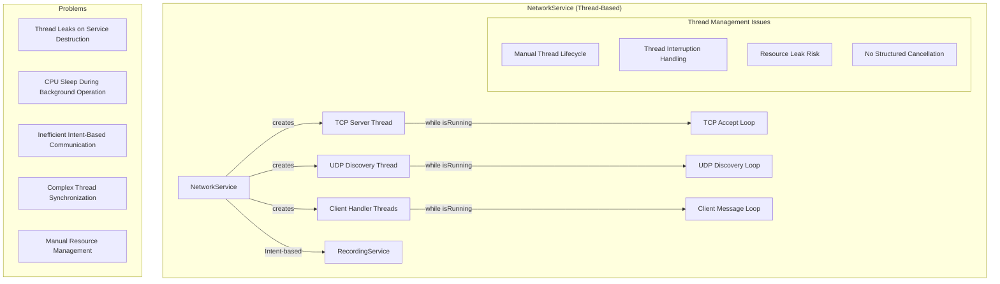
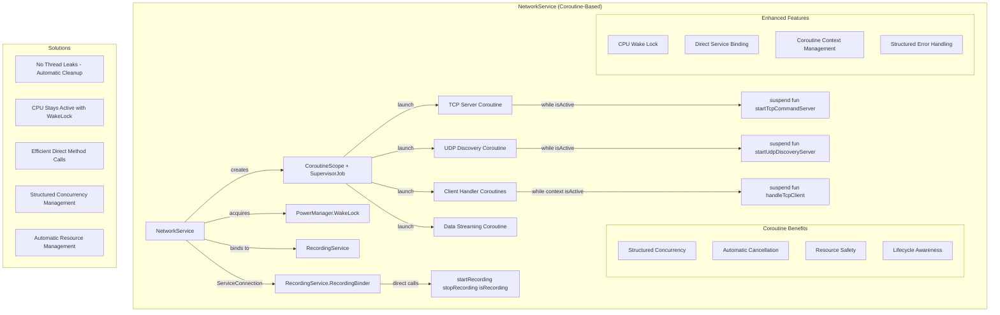

# NetworkService Coroutines Refactoring Architecture

## Overview
This document describes the architectural changes made to refactor NetworkService from using raw Java-style threads to modern Kotlin Coroutines for improved reliability, resource management, and maintainability.

## Before: Thread-Based Architecture



## After: Coroutine-Based Architecture



## Key Architectural Changes

### 1. Concurrency Model Transformation
- **Before**: Raw `thread { }` blocks with manual lifecycle management
- **After**: `CoroutineScope(Dispatchers.IO + SupervisorJob())` with structured concurrency

### 2. Resource Management Enhancement
- **Before**: Manual thread interruption and cleanup
- **After**: Automatic cancellation via `serviceScope.cancel()` and `currentCoroutineContext().isActive`

### 3. Power Management Addition
- **Before**: No power management - CPU could sleep during background operation
- **After**: `PowerManager.WakeLock` ensures CPU stays active during network operations

### 4. Service Communication Improvement
- **Before**: Intent-based communication with RecordingService
- **After**: Direct method calls via `ServiceConnection` and bound service reference

### 5. Error Handling Enhancement
- **Before**: Basic try-catch with thread-specific error handling
- **After**: Coroutine-aware exception handling with structured error propagation

## Implementation Details

### Coroutine Scope Management
```kotlin
private val serviceScope = CoroutineScope(Dispatchers.IO + SupervisorJob())

private fun startNetworking() {
    serviceScope.launch { startTcpCommandServer() }
    serviceScope.launch { startUdpDiscoveryServer() }
}

private fun stopNetworking() {
    serviceScope.cancel() // Cancels all child coroutines
}
```

### Power Management
```kotlin
private var wakeLock: PowerManager.WakeLock? = null

override fun onCreate() {
    val powerManager = getSystemService(Context.POWER_SERVICE) as PowerManager
    wakeLock = powerManager.newWakeLock(PowerManager.PARTIAL_WAKE_LOCK, "MultiModalCapture::NetworkWakelockTag")
}

private fun startNetworking() {
    wakeLock?.acquire(30 * 60 * 1000L) // 30 minutes timeout
}
```

### Direct Service Communication
```kotlin
private val recordingServiceConnection = object : ServiceConnection {
    override fun onServiceConnected(className: ComponentName, service: IBinder) {
        val binder = service as RecordingService.RecordingBinder
        recordingService = binder.getService()
        isRecordingServiceBound = true
    }
}

private fun processCommand(command: CommandProtocol.Command): CommandProtocol.Response {
    return when (command) {
        is CommandProtocol.Command.StartRecording -> {
            val success = recordingService!!.startRecording(sessionId, timestamp)
            // Direct method call instead of Intent
        }
    }
}
```

## Benefits Achieved

1. **Improved Stability**: Structured concurrency prevents thread leaks and handles cancellation automatically
2. **Enhanced Reliability**: WakeLock ensures network service remains active during background operation
3. **Better Performance**: Direct service communication is more efficient than Intent-based messaging
4. **Cleaner Code**: Coroutines provide more readable and maintainable asynchronous code
5. **Resource Safety**: Automatic resource management through coroutine lifecycle
6. **Modern Architecture**: Aligned with current Android development best practices

## Migration Impact

- **Backward Compatibility**: Maintained all existing NetworkService public APIs
- **Performance**: Improved resource utilization and reduced overhead
- **Maintainability**: Simplified debugging and error handling
- **Scalability**: Better foundation for future networking enhancements