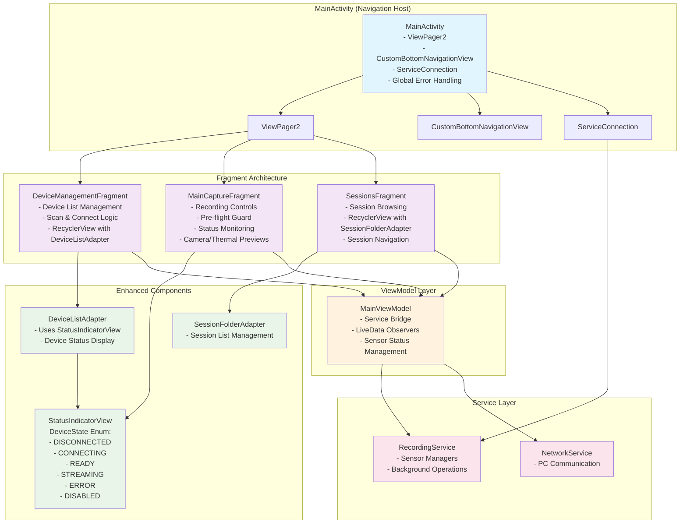

# Phase 1 UI Refactoring Architecture

## Overview
This document describes the architectural changes implemented in Phase 1 of the UI Refactoring initiative, transforming the application to use a single-activity multi-fragment approach with empowered fragments and simplified MainActivity.

## Architecture Diagram



## Key Architectural Changes

### 1. MainActivity as Navigation Host
- **Before**: Complex activity with direct UI manipulation and business logic
- **After**: Simple navigation container managing only:
  - ViewPager2 for fragment navigation
  - CustomBottomNavigationView for tab selection
  - ServiceConnection for RecordingService binding
  - Global error message display via Toast

### 2. Empowered Fragment Architecture
Each fragment now has single responsibility and self-contained functionality:

#### DeviceManagementFragment
- Manages device discovery and connection
- Handles RecyclerView with DeviceListAdapter
- Observes ViewModel for device status updates
- Provides scan and connect functionality

#### MainCaptureFragment
- **Pre-flight Guard**: Validates sensor readiness before recording
- Manages recording controls and status display
- Handles camera and thermal previews
- Uses StatusIndicatorView for visual feedback
- Implements Snackbar error display

#### SessionsFragment
- Manages session browsing and navigation
- Handles RecyclerView with SessionFolderAdapter
- Provides session folder management

### 3. Enhanced StatusIndicatorView Component
- **DeviceState Enum**: Comprehensive status representation
  - `DISCONNECTED`: Device not connected (grey)
  - `CONNECTING`: Device connecting (blue)
  - `READY`: Device ready for use (green)
  - `STREAMING`: Device actively streaming (recording color)
  - `ERROR`: Device error state (red)
  - `DISABLED`: Device disabled (grey)
- **Color-coded Visual Feedback**: Immediate status understanding
- **Reusable Component**: Used across fragments and adapters

### 4. Pre-flight Guard Implementation
```kotlin
// Sensor status validation before recording
val isCameraReady = cameraStatus.contains("ready", ignoreCase = true)
val isThermalReady = thermalStatus.contains("ready", ignoreCase = true) 
val isGsrReady = gsrStatus.contains("ready", ignoreCase = true)

when {
    !isCameraReady -> showSnackbar("Camera is not ready...")
    !isThermalReady -> showSnackbar("Thermal camera is not ready...")
    !isGsrReady -> showSnackbar("GSR sensor is not ready...")
    else -> startRecording() // All sensors ready
}
```

## Benefits Achieved

### 1. Single Responsibility Principle
- Each fragment has one clear purpose
- MainActivity only handles navigation
- Components are reusable and focused

### 2. Improved Maintainability
- Modular architecture easier to understand
- Changes isolated to specific fragments
- Reduced coupling between components

### 3. Enhanced User Experience
- Pre-flight validation prevents recording failures
- Clear visual status feedback
- Consistent error messaging via Snackbar

### 4. Better Testing
- Fragments can be tested independently
- Components are more isolated
- ViewModel provides clear testing interface

## Implementation Status
- ✅ MainActivity navigation host transformation
- ✅ Fragment empowerment and UI logic migration
- ✅ StatusIndicatorView DeviceState enhancement
- ✅ Pre-flight guard implementation
- ✅ Error handling improvements
- ✅ Component consistency across application
- ✅ Build verification and compilation success

## Next Steps (Future Phases)
- Phase 2: Advanced UI components and animations
- Phase 3: Enhanced navigation patterns
- Phase 4: Performance optimizations
- Phase 5: Accessibility improvements