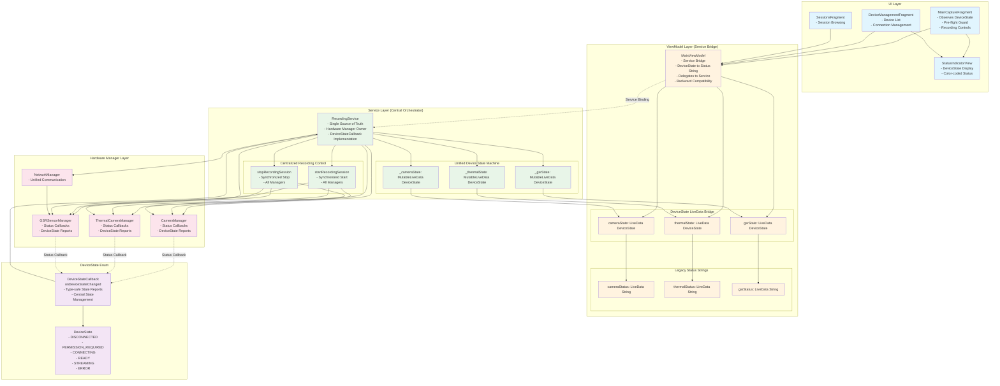

# Phase 2: MVVM + Clean Architecture Implementation

## Architecture Diagram

## Key Architectural Benefits

### 1. Single Source of Truth
- **RecordingService** owns all hardware managers
- Centralized state management prevents inconsistencies
- Synchronized recording operations across all sensors

### 2. Type-Safe State Management
- **DeviceState enum** replaces ambiguous string statuses
- **DeviceStateCallback** interface ensures consistent reporting
- Robust state machine with clear state transitions

### 3. Clean Separation of Concerns
- **UI Layer**: Pure presentation logic, observes state
- **ViewModel Layer**: Service bridge, maintains compatibility
- **Service Layer**: Hardware orchestration, business logic
- **Manager Layer**: Hardware-specific implementations

### 4. Backward Compatibility
- Legacy status strings maintained for existing UI
- Automatic conversion between DeviceState and strings
- Gradual migration path for UI components

### 5. Improved Reliability
- Centralized recording control prevents race conditions
- Service-based architecture survives configuration changes
- Proper lifecycle management for all hardware resources

## Implementation Status
- ✅ DeviceState enum and callback interface created
- ✅ RecordingService transformed to central orchestrator
- ✅ Unified device state machine implemented
- ✅ MainViewModel refactored as service bridge
- ✅ Hardware manager delegation completed
- ✅ Centralized recording control methods added
- ✅ DeviceState observer patterns established
- ✅ Status string mapping for compatibility