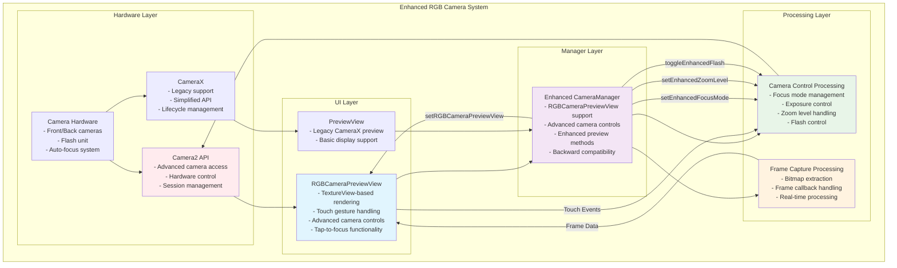
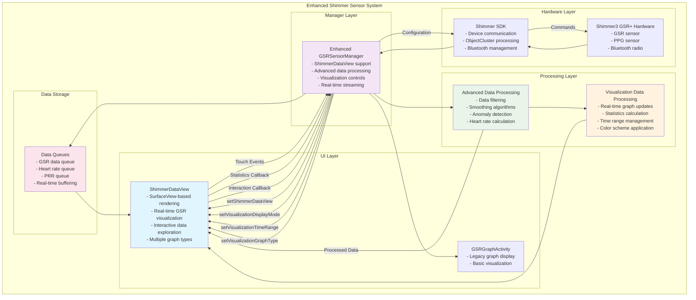
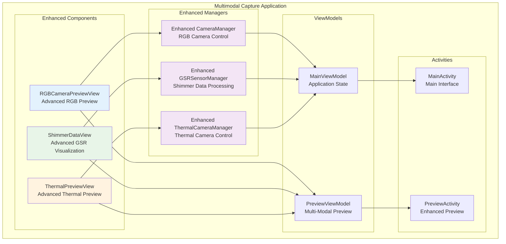

# RGB Camera and Shimmer Enhancement Architecture

## Overview
This document describes the architectural enhancements made to the RGB camera and Shimmer sensor systems by integrating advanced preview and visualization capabilities similar to the thermal camera enhancements.

## Enhanced RGB Camera Architecture



## Enhanced Shimmer Sensor Architecture



## Component Integration Overview



## Enhanced Component Descriptions

### RGBCameraPreviewView
- **Purpose**: Advanced RGB camera preview with enhanced interaction capabilities
- **Key Features**:
  - TextureView-based rendering for smooth performance
  - Touch-based zoom and pan functionality
  - Tap-to-focus with visual feedback
  - Advanced camera controls (focus, exposure, flash)
  - Real-time frame capture capabilities
  - Multi-camera switching support

### Enhanced CameraManager
- **Purpose**: Manages RGB camera operations with enhanced preview support
- **New Methods**:
  - `setRGBCameraPreviewView()`: Configure enhanced preview component
  - `switchEnhancedCamera()`: Switch between front/back cameras
  - `setEnhancedFocusMode()`: Configure focus behavior
  - `setEnhancedExposureMode()`: Control exposure settings
  - `setEnhancedZoomLevel()`: Manage zoom functionality
  - `toggleEnhancedFlash()`: Flash control
  - `captureEnhancedFrame()`: Frame capture functionality

### ShimmerDataView
- **Purpose**: Advanced Shimmer sensor data visualization with real-time display
- **Key Features**:
  - SurfaceView-based rendering for smooth performance
  - Multiple graph types (line, bar, area)
  - Real-time data streaming and display
  - Interactive data exploration with touch
  - Multiple color schemes and display modes
  - Statistics calculation and display
  - Time range filtering and data management

### Enhanced GSRSensorManager
- **Purpose**: Manages Shimmer sensor operations with enhanced visualization support
- **New Methods**:
  - `setShimmerDataView()`: Configure enhanced visualization component
  - `setVisualizationDisplayMode()`: Select display mode
  - `setVisualizationTimeRange()`: Configure time range
  - `setVisualizationGraphType()`: Select graph type
  - `setVisualizationColorScheme()`: Configure color scheme
  - `getVisualizationStatistics()`: Retrieve statistics
  - `exportVisualizationData()`: Export data functionality

## Advanced Processing Features

### RGB Camera Processing
1. **Touch Gesture Processing**: Multi-touch zoom, pan, and tap-to-focus
2. **Camera Control Processing**: Advanced focus, exposure, and flash control
3. **Frame Processing**: Real-time bitmap capture and processing
4. **Hardware Integration**: Direct Camera2 API integration for advanced features

### Shimmer Data Processing
1. **Real-time Data Processing**: Live GSR, heart rate, and PRR processing
2. **Advanced Analytics**: Data filtering, smoothing, and anomaly detection
3. **Visualization Processing**: Real-time graph updates and statistics
4. **Interactive Processing**: Touch-based data exploration and selection

## Integration Benefits

### RGB Camera Enhancements
1. **Enhanced User Experience**: Touch-based camera controls and smooth preview
2. **Advanced Functionality**: Professional camera features and controls
3. **Improved Performance**: TextureView-based rendering for smooth operation
4. **Flexible Integration**: Easy integration with existing camera workflows
5. **Backward Compatibility**: Maintains support for existing CameraX preview

### Shimmer Sensor Enhancements
1. **Real-time Visualization**: Live data display with multiple graph types
2. **Interactive Analysis**: Touch-based data exploration and selection
3. **Advanced Analytics**: Data filtering, smoothing, and anomaly detection
4. **Flexible Display**: Multiple color schemes and display modes
5. **Data Export**: Easy data export and statistics retrieval

## Data Flow Descriptions

### RGB Camera Data Flow
```
Camera Hardware → Camera2 API → RGBCameraPreviewView → 
Enhanced CameraManager → Frame Processing → 
Real-time Display → User Interaction → Camera Controls
```

**Processing Steps:**
1. **Hardware Capture**: Camera hardware provides video stream
2. **API Processing**: Camera2 API manages camera session and controls
3. **Preview Rendering**: RGBCameraPreviewView renders stream with TextureView
4. **Manager Coordination**: Enhanced CameraManager coordinates preview and controls
5. **Frame Processing**: Real-time frame capture and bitmap processing
6. **User Interaction**: Touch events trigger camera controls and focus
7. **Control Feedback**: Camera settings updated based on user interaction

### Shimmer Data Flow
```
Shimmer3 Hardware → Shimmer SDK → Enhanced GSRSensorManager → 
Advanced Data Processing → ShimmerDataView → 
Real-time Visualization → User Interaction → Data Analysis
```

**Processing Steps:**
1. **Sensor Data**: Shimmer3 GSR+ provides real-time physiological data
2. **SDK Processing**: Shimmer SDK handles ObjectCluster data processing
3. **Manager Processing**: Enhanced GSRSensorManager applies advanced analytics
4. **Data Processing**: Filtering, smoothing, and anomaly detection
5. **Visualization**: ShimmerDataView renders real-time graphs and statistics
6. **User Interaction**: Touch events enable data exploration and analysis
7. **Data Export**: Statistics and data export for further analysis

## Architecture Benefits

1. **Unified Enhancement Pattern**: Consistent enhancement approach across all sensor types
2. **Advanced Interaction**: Touch-based controls and exploration for all components
3. **Real-time Processing**: Live data processing and visualization capabilities
4. **Modular Design**: Clean separation of concerns with enhanced maintainability
5. **Backward Compatibility**: Maintains support for existing functionality
6. **Performance Optimization**: SurfaceView and TextureView for smooth rendering
7. **Extensible Architecture**: Easy addition of new features and capabilities
8. **Professional Features**: Advanced controls and analytics for research applications

## Future Enhancements

### RGB Camera
- **Advanced Image Processing**: Real-time filters and image enhancement
- **Multi-Camera Synchronization**: Synchronized capture from multiple cameras
- **Video Analysis**: Real-time video analysis and object detection
- **Custom Camera Modes**: Specialized capture modes for research applications

### Shimmer Sensor
- **Advanced Signal Processing**: Sophisticated filtering and analysis algorithms
- **Machine Learning Integration**: AI-powered anomaly detection and pattern recognition
- **Multi-Sensor Fusion**: Integration with other physiological sensors
- **Cloud Analytics**: Real-time cloud-based data analysis and insights

## Performance Considerations

1. **Rendering Performance**: SurfaceView and TextureView for optimal rendering
2. **Memory Management**: Efficient bitmap and data queue management
3. **Thread Safety**: Proper threading for real-time data processing
4. **Battery Optimization**: Efficient sensor and camera usage
5. **Data Storage**: Optimized data structures for real-time processing
6. **Network Efficiency**: Minimal network usage for enhanced features