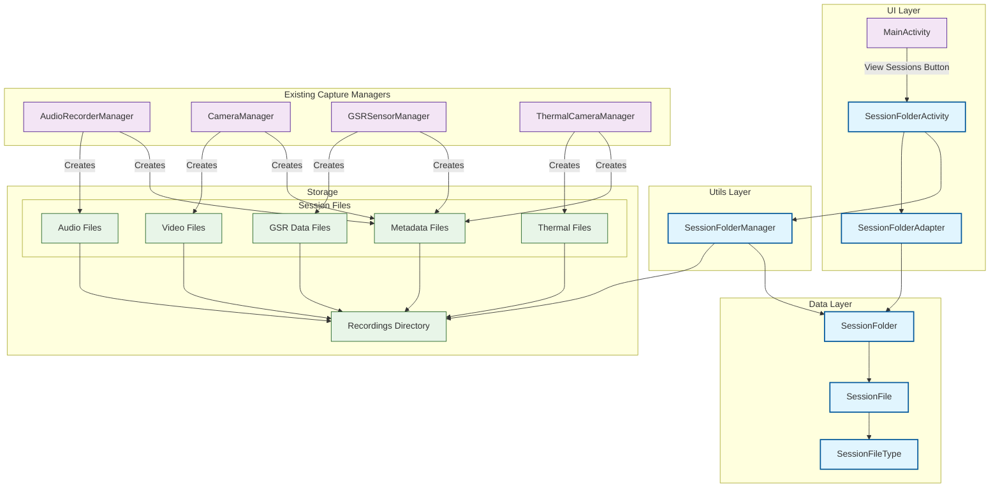

# Session Folder View Architecture

## Overview
This document describes the architectural changes made to implement the session folder view functionality in the Multi-Modal Capture Application.

## Architecture Diagram

## Component Descriptions

### New Components Added

#### UI Layer
- **SessionFolderActivity**: New activity that provides the main interface for browsing session folders
- **SessionFolderAdapter**: RecyclerView adapter that efficiently displays session folders with DiffUtil support

#### Data Layer
- **SessionFolder**: Data class representing a session with metadata (name, date, file count, size)
- **SessionFile**: Data class representing individual files within a session
- **SessionFileType**: Enum categorizing different types of session files (audio, video, GSR, thermal, metadata)

#### Utils Layer
- **SessionFolderManager**: Utility class that scans the recordings directory, groups files by session ID, and provides session management functionality

### Integration Points

#### Navigation
- Added "View Sessions" button to MainActivity
- Implemented Intent-based navigation to SessionFolderActivity
- Added activity declaration to AndroidManifest.xml

#### File Organization
- Sessions are organized by extracting session IDs from filenames
- Files follow the pattern: `{sessionId}_{type}.{extension}`
- All session files are stored in the `recordings` directory under app's external files

#### Data Flow
1. User clicks "View Sessions" in MainActivity
2. SessionFolderActivity launches and initializes SessionFolderManager
3. SessionFolderManager scans recordings directory
4. Files are grouped by session ID and converted to SessionFolder objects
5. SessionFolderAdapter displays the organized sessions in a RecyclerView
6. Users can view session details including file counts and sizes

## Key Features

### Session Organization
- Automatic grouping of files by session ID
- Support for multiple file types per session
- Chronological sorting by creation date

### User Interface
- Material Design cards for session display
- File count and size information
- Empty state handling
- Responsive layout design

### Performance Optimizations
- DiffUtil for efficient RecyclerView updates
- Lazy loading of session data
- Efficient file scanning with error handling

### Extensibility
- Modular design allows easy addition of new file types
- Session management methods ready for future features (delete, export, etc.)
- Clean separation of concerns between UI, data, and utility layers

## Future Enhancements
- Session deletion functionality
- Session export/sharing capabilities
- Detailed file view within sessions
- Session search and filtering
- Session statistics and analytics