# Thermal Camera Preview Fix Architecture

## Overview
This document describes the architectural changes made to fix the critical thermal camera preview issues that were preventing the hardware preview from showing up.

## Root Cause Analysis

### Issue 1: SDK Never Activated
The USBMonitorManager SDK was initialized but never activated because the `registerUSB()` method was not called.

### Issue 2: Initialization Callback Never Fired
The USBMonitorManager's `startPreview()` method never called `onCompleteInit()` to notify listeners that initialization was complete.

## Architecture Diagram

```mermaid
graph TB
    subgraph "Before Fix - Broken Communication Chain"
        A1[ThermalCameraManager.initialize] --> B1[usbMonitorManager.init]
        B1 --> C1[SDK Initialized but NOT Activated]
        C1 --> D1[USB Events Never Detected]
        
        E1[USBMonitorManager.startPreview] --> F1[Preview Started]
        F1 --> G1[onCompleteInit NEVER CALLED]
        G1 --> H1[Application Never Notified]
        
        I1[fragment_main_capture.xml] --> J1[ImageView - Slow Rendering]
        K1[MainCaptureFragment] --> L1[setThermalPreviewImageView]
    end
    
    subgraph "After Fix - Complete Communication Chain"
        A2[ThermalCameraManager.initialize] --> B2[usbMonitorManager.init]
        B2 --> C2[usbMonitorManager.registerUSB - FIXED]
        C2 --> D2[SDK Activated - USB Events Detected]
        
        E2[USBMonitorManager.startPreview] --> F2[Preview Started]
        F2 --> G2[onCompleteInit CALLED - FIXED]
        G2 --> H2[ThermalCameraManager.onCompleteInit]
        H2 --> I2[startPreviewStream]
        
        J2[fragment_main_capture.xml] --> K2[ThermalPreviewView - Optimized Rendering]
        L2[MainCaptureFragment] --> M2[setThermalPreviewView - UPDATED]
        M2 --> N2[MainViewModel.setThermalPreviewView - ADDED]
        N2 --> O2[ThermalCameraManager.setThermalPreviewView]
        
        P2[ThermalCameraManager.cleanup] --> Q2[usbMonitorManager.unregisterUSB - ADDED]
    end
    
    subgraph "Communication Flow"
        USB[USB Device Connected] --> SDK[SDK Detects Connection]
        SDK --> INIT[Initialization Complete]
        INIT --> PREVIEW[Preview Stream Started]
        PREVIEW --> UI[UI Updated with Thermal Data]
    end
    
    style C1 fill:#ffcccc
    style G1 fill:#ffcccc
    style H1 fill:#ffcccc
    style J1 fill:#ffcccc
    
    style C2 fill:#ccffcc
    style G2 fill:#ccffcc
    style H2 fill:#ccffcc
    style K2 fill:#ccffcc
    style M2 fill:#ccffcc
    style N2 fill:#ccffcc
    style Q2 fill:#ccffcc
```

## Key Changes Made

### 1. ThermalCameraManager.kt
- **Added**: `usbMonitorManager.registerUSB()` in `initialize()` method
- **Added**: `usbMonitorManager.unregisterUSB()` in `cleanup()` method
- **Purpose**: Activate SDK and manage lifecycle properly

### 2. USBMonitorManager.java
- **Added**: `onCompleteInit()` callback after `startPreview()` completes
- **Purpose**: Notify listeners when initialization is complete and preview is ready

### 3. UI Component Upgrade
- **Changed**: `fragment_main_capture.xml` from `ImageView` to `ThermalPreviewView`
- **Updated**: `MainCaptureFragment.kt` to use `ThermalPreviewView` type
- **Added**: `MainViewModel.setThermalPreviewView()` method
- **Purpose**: Enable optimized thermal rendering and advanced features

## Benefits

### Performance Improvements
- **Optimized Rendering**: ThermalPreviewView uses efficient rendering pipeline instead of slow Bitmap conversion
- **Advanced Features**: Touch-to-measure temperature capability
- **Resource Management**: Proper SDK lifecycle management prevents memory leaks

### Reliability Improvements
- **Complete Communication Chain**: Fixed broken communication between app and SDK
- **Proper Initialization**: SDK now properly detects USB device connections
- **Callback Mechanism**: Application is properly notified when thermal camera is ready

### Architecture Improvements
- **Separation of Concerns**: Clear distinction between SDK management and UI rendering
- **Backward Compatibility**: Maintained existing ImageView support alongside new ThermalPreviewView
- **Modern UI Components**: Upgraded to specialized thermal rendering component

## Testing Results
- **Build Status**: ✅ Successful compilation
- **Device Testing**: ✅ Successfully deployed to Samsung device (SM-S901E)
- **Functionality**: ✅ Thermal camera preview now functional

## Future Considerations
- Monitor thermal camera connection stability
- Consider adding more advanced thermal analysis features
- Evaluate performance optimizations for high-frequency thermal data processing