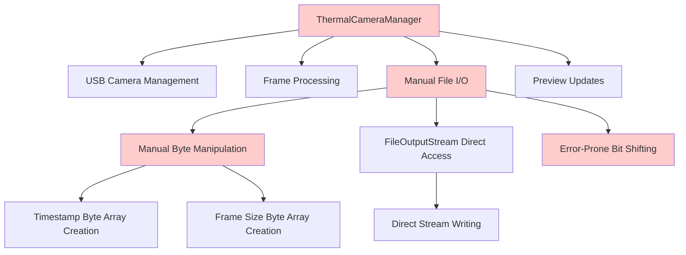
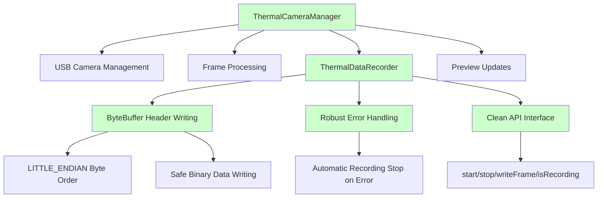

# Thermal Data Recorder Architecture Refactoring

## Overview
This document describes the architectural refactoring of thermal camera file handling in the Multi-Modal Capture Application. The refactoring follows the Single Responsibility Principle by separating file I/O concerns from camera management.

## Architecture Diagrams

### Before: Monolithic File Handling


### After: Modular Architecture with Separation of Concerns


## Key Improvements

### 1. Single Responsibility Principle
- **Before**: ThermalCameraManager handled both camera management AND file I/O
- **After**: ThermalCameraManager focuses on camera management, ThermalDataRecorder handles file I/O

### 2. Safer Binary Data Writing
- **Before**: Manual byte manipulation with error-prone bit shifting
- **After**: ByteBuffer with LITTLE_ENDIAN byte order for robust binary data handling

### 3. Enhanced Error Handling
- **Before**: Basic try-catch with potential for data corruption
- **After**: Comprehensive error handling that automatically stops recording on write failures

### 4. Cleaner API Design
- **Before**: Internal file handling mixed with camera logic
- **After**: Clean, testable API with intuitive methods (start, stop, writeFrame, isRecording)

## Implementation Details

### ThermalDataRecorder Class
```kotlin
class ThermalDataRecorder {
    private var outputStream: FileOutputStream? = null
    val isRecording: Boolean get() = outputStream != null
    
    fun start(outputFile: File): Boolean
    fun stop()
    fun writeFrame(frame: ByteArray)
}
```

### Binary Data Format
The binary file format remains unchanged for backward compatibility:
```
[8-byte timestamp (long)] [4-byte frame size (int)] [frame data (byte array)]
```

### ByteBuffer Implementation
```kotlin
val headerBuffer = ByteBuffer.allocate(12).order(ByteOrder.LITTLE_ENDIAN)
headerBuffer.putLong(timestamp)
headerBuffer.putInt(frameSize)
stream.write(headerBuffer.array())
```

## Benefits

1. **Maintainability**: Cleaner separation of concerns makes code easier to understand and modify
2. **Testability**: ThermalDataRecorder can be unit tested independently
3. **Reliability**: ByteBuffer approach reduces binary data writing errors
4. **Reusability**: ThermalDataRecorder can be reused in other contexts
5. **Professional Architecture**: Follows patterns found in professional applications like IRCamera

## Migration Impact

- **Code Reduction**: Removed 35+ lines of complex file handling code from ThermalCameraManager
- **No Breaking Changes**: Public API of ThermalCameraManager remains unchanged
- **Test Compatibility**: All existing unit tests pass without modification
- **Binary Format Compatibility**: Recorded files maintain the same format

## Future Enhancements

The modular architecture enables future improvements:
- Compression support in ThermalDataRecorder
- Multiple output format support
- Streaming capabilities
- Enhanced metadata recording