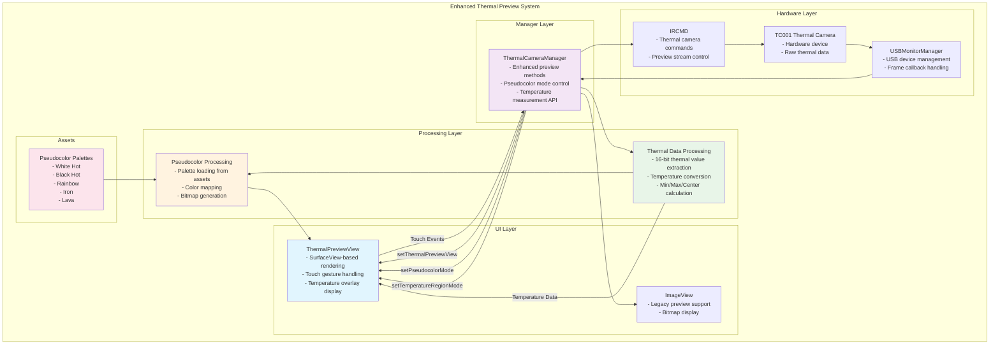

# Enhanced Thermal Camera Preview Architecture

## Overview
This document describes the architectural enhancements made to the thermal camera preview system by integrating components from the IRCamera project.

## Architecture Diagram

## Component Descriptions

### ThermalPreviewView
- **Purpose**: Enhanced thermal preview component with advanced visualization capabilities
- **Key Features**:
  - SurfaceView-based rendering for smooth performance
  - Multiple pseudocolor palette support
  - Touch-based temperature measurement
  - Real-time temperature display overlay
  - Point, line, rectangle, and center measurement modes

### Enhanced ThermalCameraManager
- **Purpose**: Manages thermal camera operations with enhanced preview support
- **New Methods**:
  - `setThermalPreviewView()`: Configure enhanced preview component
  - `setPseudocolorMode()`: Select color palette for thermal display
  - `setTemperatureRegionMode()`: Configure measurement mode
  - `setTemperatureMeasurementEnabled()`: Enable/disable touch interaction
  - `clearTemperatureMeasurements()`: Reset measurement overlays

### Thermal Data Processing
- **Purpose**: Process raw thermal data for display and measurement
- **Capabilities**:
  - 16-bit thermal value extraction
  - Temperature conversion with calibration support
  - Min/Max/Center temperature calculation
  - Real-time data analysis

### Pseudocolor Processing
- **Purpose**: Apply color palettes to thermal data for enhanced visualization
- **Features**:
  - Multiple palette support (White Hot, Black Hot, Rainbow, Iron, Lava)
  - Asset-based palette loading
  - Real-time color mapping
  - Optimized bitmap generation

## Integration Benefits

1. **Enhanced Visualization**: Multiple pseudocolor palettes provide better thermal data interpretation
2. **Temperature Measurement**: Real-time temperature measurement with multiple region types
3. **Improved Performance**: SurfaceView-based rendering for smooth frame display
4. **Touch Interaction**: Intuitive touch-based temperature measurement selection
5. **Backward Compatibility**: Maintains support for existing ImageView-based preview
6. **Modular Design**: Clean separation of concerns with enhanced maintainability

## Data Flow

1. **Thermal Data Acquisition**: TC001 camera provides raw thermal frames
2. **USB Management**: USBMonitorManager handles device communication
3. **Frame Processing**: ThermalCameraManager processes incoming frames
4. **Data Analysis**: Thermal data processing extracts temperature information
5. **Visualization**: Pseudocolor processing applies color palettes
6. **Display**: ThermalPreviewView renders enhanced thermal preview
7. **Interaction**: Touch events enable temperature measurement functionality

## Future Enhancements

- **Advanced Calibration**: Implement precise temperature calibration algorithms
- **Additional Palettes**: Add more pseudocolor palette options
- **Measurement Export**: Enable temperature measurement data export
- **Thermal Analysis**: Add thermal pattern analysis capabilities
- **Performance Optimization**: Further optimize rendering performance