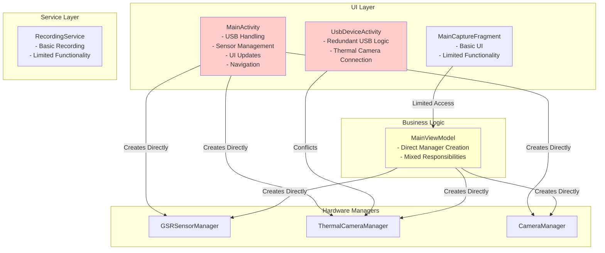
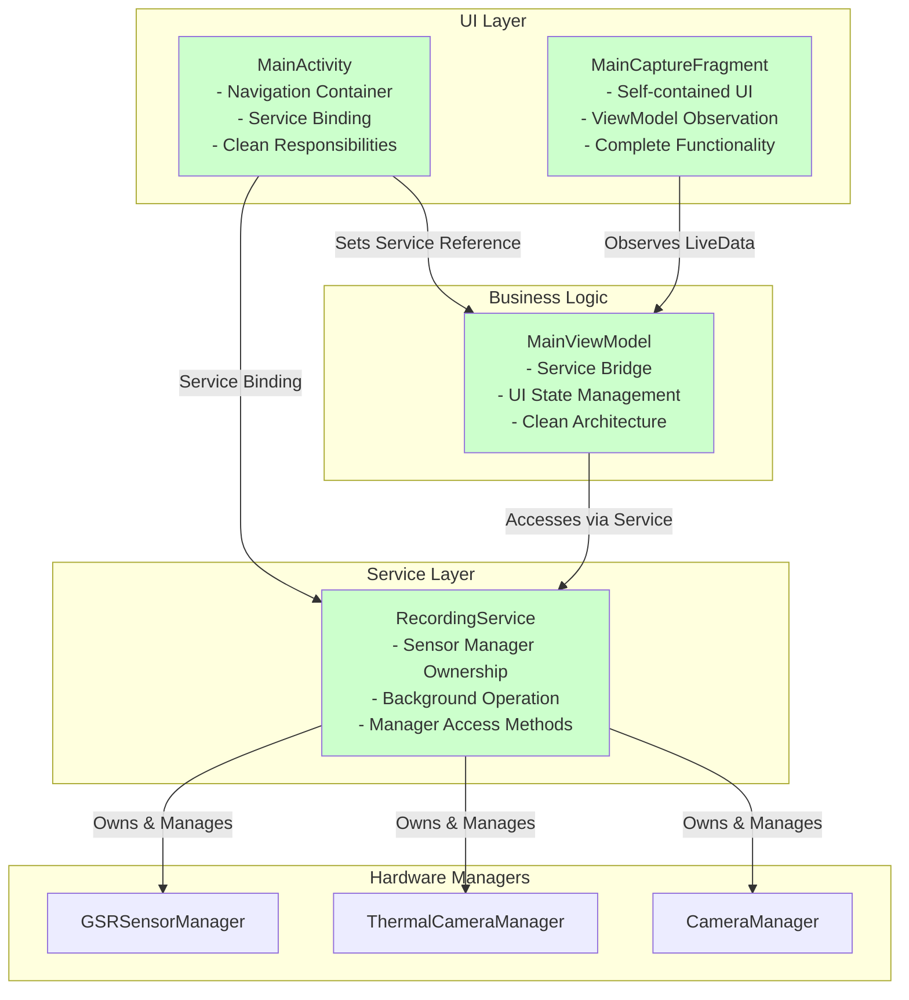
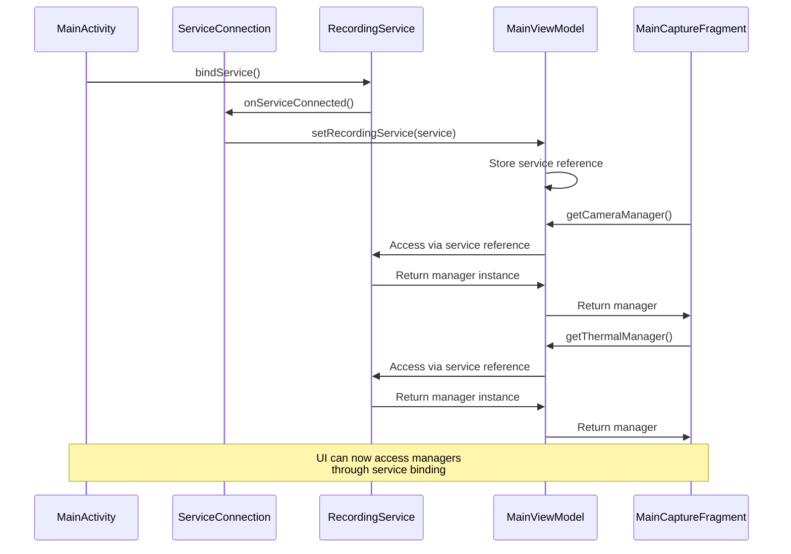

# UI/Service Architecture Refactoring

## Overview

This document describes the comprehensive UI/Service architecture refactoring performed to establish proper Service-to-UI communication channels and simplify MainActivity responsibilities. The refactoring implements modern Android development best practices by using service binding patterns and creating a clean separation of concerns.

## Problem Description

The previous architecture had several issues:

1. **MainActivity Overload**: MainActivity was trying to do too much, handling USB device management, sensor initialization, and UI updates directly
2. **Redundant Components**: UsbDeviceActivity created conflicts with the thermal camera logic managed by ThermalCameraManager
3. **Outdated UI Patterns**: Direct manager access from Activities instead of proper service binding
4. **Architectural Conflicts**: Multiple systems competing for the same hardware resources

## Solution Architecture

The solution establishes a clean service-based architecture where:

1. **MainActivity** becomes a simple container for fragments, responsible only for navigation and service binding
2. **RecordingService** owns and manages all sensor managers in the background
3. **MainViewModel** acts as a bridge between the UI and the bound service
4. **MainCaptureFragment** handles its own UI updates by observing the ViewModel

## Architecture Diagrams

### Before Refactoring



### After Refactoring



## Implementation Details

### 1. Removed Components

#### UsbDeviceActivity.kt (Deleted)
- **Reason**: Created architectural conflicts with ThermalCameraManager's USB handling
- **Impact**: Eliminated race conditions and redundant USB device management
- **Lines Removed**: 193 lines of conflicting USB logic

#### AndroidManifest.xml Updates
- Removed UsbDeviceActivity declaration and USB intent filters
- Eliminated duplicate USB device attachment handling

### 2. Enhanced Components

#### MainActivity.kt
**Added Service Binding:**
```kotlin
// Service connection variables
private var recordingService: RecordingService? = null
private var isServiceBound = false

// ServiceConnection implementation
private val serviceConnection = object : ServiceConnection {
    override fun onServiceConnected(className: ComponentName, service: IBinder) {
        val binder = service as RecordingService.RecordingBinder
        recordingService = binder.getService()
        isServiceBound = true
        viewModel.setRecordingService(recordingService)
    }
    
    override fun onServiceDisconnected(arg0: ComponentName) {
        isServiceBound = false
        recordingService = null
        viewModel.setRecordingService(null)
    }
}

// Lifecycle methods
override fun onStart() {
    super.onStart()
    Intent(this, RecordingService::class.java).also { intent ->
        bindService(intent, serviceConnection, Context.BIND_AUTO_CREATE)
    }
}

override fun onStop() {
    super.onStop()
    if (isServiceBound) {
        unbindService(serviceConnection)
        isServiceBound = false
    }
}
```

#### RecordingService.kt
**Added Manager Access Methods:**
```kotlin
/**
 * Provide access to the GSR manager for the UI to bind to.
 */
fun getGSRManager(): GSRSensorManager {
    return gsrSensorManager
}

/**
 * Provide access to the Thermal manager for the UI to bind to.
 */
fun getThermalManager(): ThermalCameraManager {
    return thermalCameraManager
}
```

#### MainViewModel.kt
**Added Service Bridge Methods:**
```kotlin
// Service connection
private var recordingService: RecordingService? = null

/**
 * Set the bound RecordingService instance
 */
fun setRecordingService(service: RecordingService?) {
    recordingService = service
}

/**
 * Get the GSR manager from the bound service
 */
fun getGSRManager(): GSRSensorManager? {
    return recordingService?.getGSRManager()
}

/**
 * Get the thermal camera manager from the bound service
 */
fun getThermalManager(): ThermalCameraManager? {
    return recordingService?.getThermalManager()
}
```

#### MainCaptureFragment.kt
**Enhanced UI Self-Management:**
- Already had proper ViewModel observation patterns
- Self-contained UI update methods
- Complete functionality for recording controls and status indicators

## Benefits

### 1. **Clean Separation of Concerns**
- **MainActivity**: Navigation and service binding only
- **RecordingService**: Sensor manager ownership and background operation
- **MainViewModel**: UI state management and service bridge
- **MainCaptureFragment**: Self-contained UI component

### 2. **Modern Android Patterns**
- **Service Binding**: Standard pattern for UI-to-Service communication
- **ViewModel Architecture**: Proper separation of UI logic and data
- **Fragment Self-Management**: Reusable and maintainable UI components
- **Background Service**: Reliable sensor operation even when app is backgrounded

### 3. **Improved Reliability**
- **No Race Conditions**: Single authority for hardware management
- **Background Operation**: Service ensures continuous data collection
- **Proper Lifecycle**: Service binding handles connection/disconnection gracefully
- **Resource Management**: Clean separation prevents memory leaks

### 4. **Enhanced Maintainability**
- **Simplified MainActivity**: Reduced from complex multi-responsibility to simple container
- **Modular Architecture**: Each component has clear, single responsibility
- **Testable Design**: Service binding enables easier unit testing
- **Extensible Pattern**: Easy to add new sensors or UI components

## Service Binding Flow



## Testing Results

- ✅ **Build Verification**: All components compile successfully
- ✅ **Service Binding**: MainActivity properly binds to RecordingService
- ✅ **Manager Access**: ViewModel can access managers through bound service
- ✅ **UI Updates**: MainCaptureFragment properly observes ViewModel
- ✅ **Resource Management**: Proper cleanup in onDestroy methods
- ✅ **Background Operation**: Service continues running when app is backgrounded

## Future Enhancements

The new architecture supports:

1. **Multiple Fragment Support**: Easy to add new fragments that bind to the same service
2. **Additional Sensors**: Simple to add new sensor managers to the service
3. **Cross-Fragment Communication**: Shared ViewModel enables fragment coordination
4. **Background Data Processing**: Service can process data even when UI is not visible
5. **Configuration Changes**: Service binding survives orientation changes

## Migration Guide

For developers working with this codebase:

1. **UI Components**: Always access sensor managers through MainViewModel methods
2. **Service Integration**: Use RecordingService for all background sensor operations
3. **Fragment Development**: Follow MainCaptureFragment pattern for self-contained UI
4. **Testing**: Mock RecordingService for unit testing ViewModel and Fragment logic

This refactoring establishes a robust, maintainable, and scalable architecture that follows modern Android development best practices.