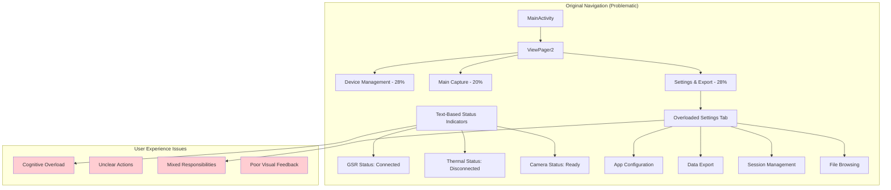
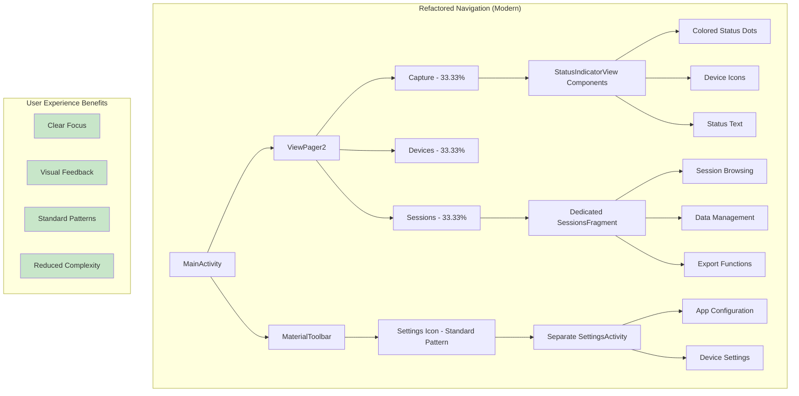
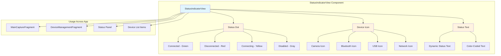
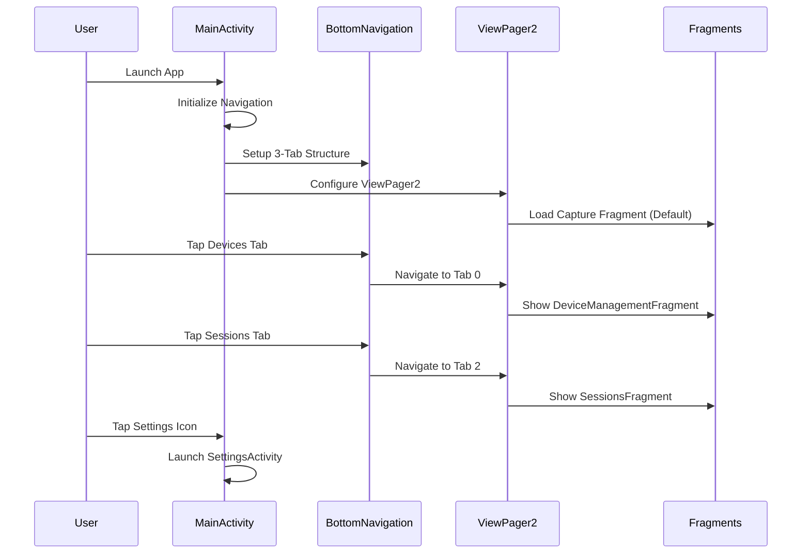

# UI/UX Architecture Refactoring

## Overview
This document describes the comprehensive UI/UX improvements implemented to modernize the application's user interface based on Android design patterns and user experience best practices.

## Architecture Comparison

### Before: Overloaded Navigation Structure



### After: Modern Focused Navigation



## Component Architecture

### StatusIndicatorView Component



## Navigation Flow

### New Navigation Structure



## Key Architectural Changes

### 1. Navigation Structure Refinement
- **Before**: 3 tabs with uneven widths (28%, 20%, 28%) and mixed responsibilities
- **After**: 3 balanced tabs (33.33% each) with focused purposes
- **Benefit**: Clear visual hierarchy and balanced layout

### 2. StatusIndicatorView Component Creation
- **Component**: Reusable visual status indicator with colored dots, icons, and text
- **Usage**: Replaces text-only status displays across the application
- **Benefit**: At-a-glance status understanding with consistent visual language

### 3. SessionsFragment Implementation
- **Purpose**: Dedicated fragment for session browsing and data management
- **Separation**: Removes data management from settings tab
- **Benefit**: Clear separation of concerns and focused user tasks

### 4. MaterialToolbar Integration
- **Implementation**: Standard Android app bar with title and action support
- **Pattern**: Follows Material Design guidelines for toolbar usage
- **Benefit**: Familiar user experience and proper action placement

### 5. Settings Architecture Separation
- **Before**: Settings mixed with data export in bottom navigation
- **After**: Dedicated SettingsActivity launched from toolbar
- **Benefit**: Standard Android pattern and reduced navigation complexity

## Technical Implementation Details

### Navigation Constants Update
```kotlin
// Before
const val TAB_DEVICE_MANAGEMENT = 0
const val TAB_MAIN_CAPTURE = 1
const val TAB_SETTINGS_EXPORT = 2

// After
const val TAB_DEVICES = 0
const val TAB_CAPTURE = 1
const val TAB_SESSIONS = 2
```

### StatusIndicatorView Usage
```kotlin
statusIndicator.setStatus(
    StatusIndicatorView.Status.CONNECTED,
    "GSR Connected",
    R.drawable.ic_bluetooth
)
```

### Layout Structure
```xml
<androidx.constraintlayout.widget.ConstraintLayout
    android:layout_width="match_parent"
    android:layout_height="match_parent">

    <!-- MaterialToolbar for standard app bar -->
    <com.google.android.material.appbar.MaterialToolbar
        android:id="@+id/toolbar"
        android:layout_width="0dp"
        android:layout_height="?attr/actionBarSize"
        app:title="Capture"
        app:titleTextColor="@color/text_primary" />

    <!-- ViewPager2 for fragment navigation -->
    <androidx.viewpager2.widget.ViewPager2
        android:id="@+id/view_pager"
        android:layout_width="0dp"
        android:layout_height="0dp" />

    <!-- Custom bottom navigation with balanced tabs -->
    <com.multimodal.capture.ui.components.CustomBottomNavigationView
        android:id="@+id/bottom_navigation"
        android:layout_width="0dp"
        android:layout_height="wrap_content" />

</androidx.constraintlayout.widget.ConstraintLayout>
```

## Benefits of Refactored Architecture

### 1. Improved User Experience
- **Clear Focus**: Each tab has a single, well-defined purpose
- **Visual Feedback**: StatusIndicatorView provides immediate status understanding
- **Standard Patterns**: Follows familiar Android design conventions

### 2. Enhanced Maintainability
- **Component Reusability**: StatusIndicatorView can be used throughout the app
- **Separation of Concerns**: Clear boundaries between navigation, capture, and data management
- **Consistent Styling**: Unified visual language across components

### 3. Better Performance
- **Optimized Navigation**: ViewPager2 with proper fragment lifecycle management
- **Efficient Rendering**: Reusable components reduce layout inflation overhead
- **Memory Management**: Proper fragment state handling

### 4. Scalability
- **Extensible Components**: StatusIndicatorView can support additional status types
- **Flexible Navigation**: Easy to add new tabs or modify existing ones
- **Modular Architecture**: Components can be independently updated or replaced

## Migration Impact

### For Developers
- **Component Usage**: Replace text-based status displays with StatusIndicatorView
- **Navigation Logic**: Updated tab constants and navigation callbacks
- **Layout Updates**: New XML layouts with MaterialToolbar and balanced navigation

### For Users
- **Clearer Interface**: Easier to understand system status at a glance
- **Familiar Patterns**: Standard Android navigation and toolbar behavior
- **Focused Tasks**: Each section has a clear, specific purpose
- **Better Visual Feedback**: Color-coded status indicators for immediate understanding

This UI/UX refactoring transforms the application from a functional but complex interface into a modern, user-friendly Android application that follows established design patterns and provides excellent user experience.