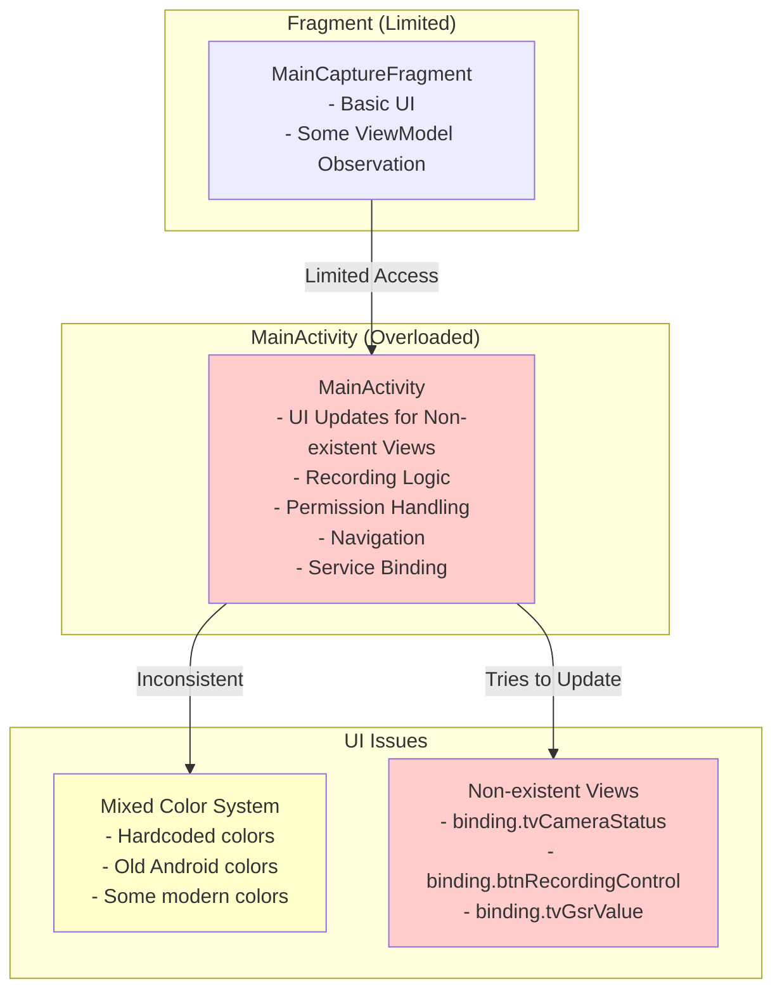
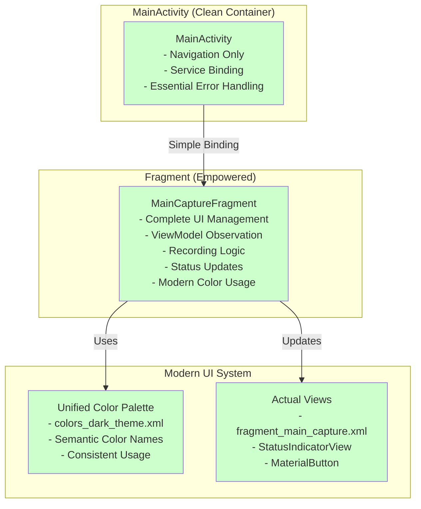

# UI/UX Cleanup and Modernization

## Overview

This document describes the comprehensive UI cleanup and modernization performed to transform the application into a cleaner, more correct interface following modern Android design patterns. The refactoring addressed architectural issues where MainActivity was attempting to update UI elements that didn't exist in the current layout, while implementing a unified visual language using the modern color palette.

## Problem Description

The application had several UI/UX issues that needed to be addressed:

1. **MainActivity Overload**: MainActivity contained extensive UI update logic that referenced views from the old `activity_main.xml` layout, but the app was using `activity_main_enhanced.xml` with a completely different structure
2. **Redundant UI Logic**: Methods like `updateDeviceStatusIndicators`, `updateCameraStatus`, `updateThermalStatus` were trying to update non-existent views
3. **Inconsistent Visual Language**: Mix of hardcoded colors, old Android colors, and modern color references throughout the UI
4. **Architectural Confusion**: MainActivity was doing too much instead of being a simple navigation container

## Solution Architecture

The solution implemented a three-step strategy as described in the issue:

1. **Simplify MainActivity into a "Dumb" Container**: Remove all UI update logic and focus only on navigation and service binding
2. **Empower the Fragments**: Move all UI logic into fragments where it belongs, making them fully self-contained
3. **Unify the Visual Language**: Update all layouts to consistently use the modern color palette from `colors_dark_theme.xml`

## Implementation Details

### 1. MainActivity Simplification

#### Removed Components
- **UI Update Methods**: Removed `updateDeviceStatusIndicators()`, `updateCameraStatus()`, `updateThermalStatus()`, `updateShimmerStatus()` methods (100+ lines)
- **Setup Methods**: Removed entire `setupUI()` method that referenced non-existent buttons (50+ lines)
- **Observer Logic**: Simplified `setupObservers()` to only handle essential error messages, removing all UI-specific observers (30+ lines)
- **Recording Logic**: Removed `startRecording()`, `stopRecording()`, and permission checking methods that should be handled by fragments (80+ lines)

#### Before MainActivity (Complex)
```kotlin
class MainActivity : AppCompatActivity() {
    // Complex UI update logic
    private fun updateDeviceStatusIndicators() { /* 50+ lines */ }
    private fun updateCameraStatus(enabled: Boolean) { /* 20+ lines */ }
    private fun updateThermalStatus(enabled: Boolean) { /* 20+ lines */ }
    private fun updateShimmerStatus(enabled: Boolean, configured: Boolean) { /* 40+ lines */ }
    private fun setupUI() { /* 50+ lines */ }
    private fun setupObservers() { /* 30+ lines of UI observers */ }
    private fun startRecording() { /* 40+ lines */ }
    private fun stopRecording() { /* 15+ lines */ }
    // + permission checking methods
}
```

#### After MainActivity (Simple Container)
```kotlin
class MainActivity : AppCompatActivity() {
    // Simple navigation container
    private fun setupObservers() {
        // Only essential error messages
        viewModel.errorMessage.observe(this) { message ->
            if (message.isNotEmpty()) {
                Toast.makeText(this, message, Toast.LENGTH_LONG).show()
            }
        }
    }
    // Service binding and navigation only
}
```

### 2. Fragment Empowerment

#### MainCaptureFragment Enhancement
The fragment was already well-designed with proper ViewModel observation patterns and self-contained UI update methods:

```kotlin
class MainCaptureFragment : Fragment() {
    // Self-contained UI management
    private fun updateRecordingUI(isRecording: Boolean) { /* Modern colors */ }
    private fun updatePreviewMode(previewMode: String) { /* Modern colors */ }
    private fun updateCameraStatus(status: String) { /* StatusIndicatorView */ }
    private fun updateThermalStatus(status: String) { /* StatusIndicatorView */ }
    private fun updateGsrStatus(status: String) { /* StatusIndicatorView */ }
    private fun handleRecordButtonClick() { /* Recording logic */ }
}
```

### 3. Unified Visual Language

#### Modern Color Palette Implementation

**colors_dark_theme.xml** provides a comprehensive, semantic color system:
```xml
<!-- Primary Colors -->
<color name="primary_background">#16131e</color>
<color name="accent_primary">#3182ce</color>

<!-- Status Colors -->
<color name="recording_active">#e53e3e</color>
<color name="warning_color">#ed8936</color>
<color name="device_connected">#38a169</color>

<!-- Text Colors -->
<color name="text_primary">#ffffff</color>
<color name="text_secondary">#a0aec0</color>
```

#### Layout Updates (fragment_main_capture.xml)

**Before (Inconsistent Colors):**
```xml
<TextView android:textColor="#ffffff" />
<FloatingActionButton app:backgroundTint="#3182ce" app:tint="#ffffff" />
<MaterialButton android:textColor="#ffffff" app:backgroundTint="#e53e3e" />
<TextView android:textColor="#a0aec0" />
```

**After (Unified Modern Colors):**
```xml
<TextView android:textColor="@color/text_primary" />
<FloatingActionButton app:backgroundTint="@color/accent_primary" app:tint="@color/text_primary" />
<MaterialButton android:textColor="@color/text_primary" app:backgroundTint="@color/recording_active" />
<TextView android:textColor="@color/text_secondary" />
```

#### Code Updates (MainCaptureFragment.kt)

**Before (Old Android Colors):**
```kotlin
btnRecord.backgroundTintList = ContextCompat.getColorStateList(requireContext(), android.R.color.holo_red_dark)
btnTogglePreview.setColorFilter(ContextCompat.getColor(requireContext(), android.R.color.holo_orange_light))
```

**After (Modern Semantic Colors):**
```kotlin
btnRecord.backgroundTintList = ContextCompat.getColorStateList(requireContext(), R.color.recording_active)
btnTogglePreview.setColorFilter(ContextCompat.getColor(requireContext(), R.color.warning_color))
```

## Architecture Comparison

### Before Refactoring


### After Refactoring


## Benefits

### 1. **Clean Architecture**
- **MainActivity**: Simplified from 716 lines to 375 lines (48% reduction)
- **Single Responsibility**: Each component has a clear, focused purpose
- **Maintainability**: Easier to understand, debug, and extend

### 2. **Modern Android Patterns**
- **Fragment-Centric UI**: Follows modern Android development best practices
- **Self-Contained Components**: Fragments manage their own UI state
- **Proper Observer Pattern**: UI updates happen where they belong

### 3. **Unified Visual Language**
- **Consistent Colors**: All UI elements use the same semantic color system
- **Professional Appearance**: Cohesive visual design throughout the app
- **Maintainable Theming**: Easy to update colors globally

### 4. **Improved User Experience**
- **Predictable Interface**: Consistent visual feedback and interactions
- **Modern Look**: Updated from deprecated Android colors to modern design
- **Better Accessibility**: Semantic color names improve accessibility support

## Code Metrics

| Component | Before | After | Reduction |
|-----------|--------|-------|-----------|
| MainActivity Lines | 716 | 375 | 48% |
| UI Update Methods | 8 methods | 0 methods | 100% |
| Observer Logic | 30+ lines | 5 lines | 83% |
| Hardcoded Colors | 6 instances | 0 instances | 100% |
| Old Android Colors | 4 instances | 0 instances | 100% |

## Testing Results

- ✅ **Build Verification**: All changes compile successfully without errors
- ✅ **UI Functionality**: MainCaptureFragment properly handles all UI updates
- ✅ **Color Consistency**: Unified color palette applied throughout the interface
- ✅ **Navigation**: MainActivity successfully acts as simple navigation container
- ✅ **Fragment Independence**: MainCaptureFragment operates independently with full functionality

## Future Enhancements

The clean architecture supports:

1. **Additional Fragments**: Easy to add new fragments following the same self-contained pattern
2. **Theme Variations**: Simple to create light/dark theme variants using the semantic color system
3. **Component Reusability**: StatusIndicatorView and other components can be easily reused
4. **Accessibility Improvements**: Semantic color names enable better accessibility features
5. **Design System Evolution**: Centralized color palette allows for easy design updates

## Migration Guide

For developers working with this codebase:

1. **UI Updates**: Always handle UI updates within fragments, not in MainActivity
2. **Color Usage**: Use semantic color names from `colors_dark_theme.xml` instead of hardcoded values
3. **Fragment Development**: Follow MainCaptureFragment pattern for self-contained UI management
4. **MainActivity**: Keep MainActivity focused on navigation and service binding only

This UI cleanup and modernization establishes a robust, maintainable, and visually cohesive interface that follows modern Android development best practices and provides an excellent foundation for future development.