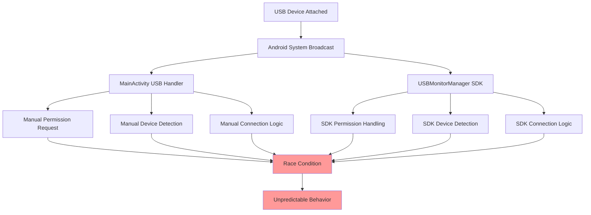
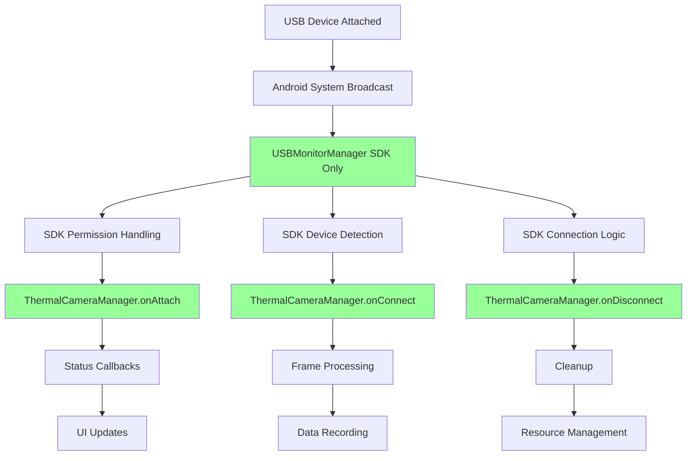

# USB Connection Architecture Refactoring

## Overview

This document describes the critical architectural refactoring performed to resolve USB connection lifecycle conflicts in the thermal camera integration. The refactoring eliminated redundant USB handling systems that were causing race conditions and unpredictable behavior.

## Problem Description

The application previously had two competing systems handling USB device attachment events:

1. **Manual System (MainActivity)**: Custom USB device detection, permission handling, and connection management
2. **Automatic System (USBMonitorManager SDK)**: Vendor-provided SDK handling the same USB events internally

This created a race condition where both systems would compete to handle the same USB_DEVICE_ATTACHED system broadcasts, leading to unpredictable behavior and potential connection failures.

## Solution Architecture

The solution delegates all USB connection lifecycle management exclusively to the vendor's USBMonitorManager SDK through the ThermalCameraManager, eliminating the architectural conflict.

### Before Refactoring

### After Refactoring

## Implementation Details

### Removed Components

1. **MainActivity USB Handling**:
   - `setupUsbPermissionReceiver()` method
   - `handleUsbDeviceAttachment()` method
   - `isThermalCamera()` method
   - `isUsbCamera()` method
   - `requestUsbPermission()` method
   - `onUsbPermissionGranted()` method
   - `connectToThermalCameraWhenReady()` method
   - USB-related class variables (`usbManager`, `usbPermissionReceiver`)
   - USB cleanup code in `onDestroy()`
   - `ACTION_USB_PERMISSION` constant

2. **AndroidManifest.xml Changes**:
   - Removed `USB_DEVICE_ATTACHED` intent filter from MainActivity
   - Removed USB device filter metadata reference

3. **Import Cleanup**:
   - Removed `android.app.PendingIntent`
   - Removed `android.content.BroadcastReceiver`
   - Removed `android.content.IntentFilter`
   - Removed `android.hardware.usb.UsbDevice`
   - Removed `android.hardware.usb.UsbManager`

### Retained Components

1. **ThermalCameraManager**: Already properly implements `OnUSBConnectListener` interface
2. **USBMonitorManager Integration**: Already properly initialized in `ThermalCameraManager.initialize()`
3. **RecordingService Integration**: ThermalCameraManager properly instantiated and managed within service context

## Benefits

1. **Eliminated Race Conditions**: Only one system handles USB events
2. **Simplified Architecture**: Removed 200+ lines of redundant code
3. **SDK Compliance**: Follows vendor's intended usage pattern
4. **Enhanced Reliability**: Predictable USB connection behavior
5. **Maintainability**: Cleaner separation of concerns
6. **Future-Proof**: Aligned with vendor SDK design patterns

## Verification

- ✅ Build compilation successful
- ✅ No remaining references to removed USB handling code
- ✅ ThermalCameraManager properly integrated in RecordingService
- ✅ USB connection lifecycle handled exclusively by SDK

## Impact

This refactoring resolves the critical architectural conflict that was causing unpredictable thermal camera connection behavior. The application now has a clean, maintainable USB connection architecture that follows the vendor SDK's intended design patterns.