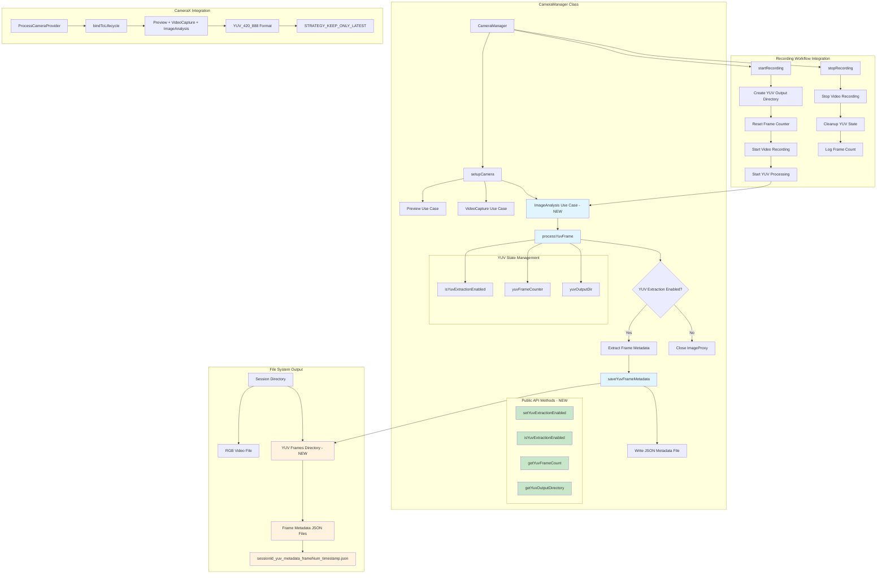

# RGB Camera YUV Stage 3 Extraction Architecture

## Overview
This document describes the architectural changes made to implement YUV stage 3 image extraction in the RGB camera module.

## Architecture Diagram

## Key Architectural Changes

### 1. ImageAnalysis Use Case Addition
- **Component**: New ImageAnalysis use case in CameraManager
- **Purpose**: Extract YUV frames in real-time during camera operation
- **Configuration**: YUV_420_888 format with STRATEGY_KEEP_ONLY_LATEST backpressure

### 2. YUV Processing Pipeline
- **processYuvFrame()**: Main processing method for YUV frame handling
- **saveYuvFrameMetadata()**: Metadata persistence with JSON format
- **Frame Counter**: Tracks processed frames per session

### 3. State Management
- **isYuvExtractionEnabled**: Runtime control flag
- **yuvFrameCounter**: Session-based frame counting
- **yuvOutputDir**: Session-specific output directory

### 4. Public API Extensions
- **setYuvExtractionEnabled()**: Enable/disable YUV extraction
- **isYuvExtractionEnabled()**: Check current extraction status
- **getYuvFrameCount()**: Get current frame count
- **getYuvOutputDirectory()**: Get output directory path

### 5. Recording Integration
- **Session Management**: YUV directory creation per recording session
- **Lifecycle Integration**: Proper cleanup on recording stop
- **Performance Optimization**: Non-blocking frame processing

## Data Flow

1. **Camera Setup**: ImageAnalysis use case added to existing Preview and VideoCapture
2. **Frame Processing**: YUV frames processed in background thread
3. **Metadata Extraction**: Frame dimensions, timestamp, and format information extracted
4. **File Persistence**: JSON metadata files saved to session-specific directory
5. **Session Management**: Directory creation on recording start, cleanup on stop

## Benefits

- **Non-Intrusive**: Doesn't affect existing video recording functionality
- **Configurable**: Runtime enable/disable capability
- **Performance Optimized**: Uses latest frame strategy to prevent backlog
- **Session Organized**: Metadata organized by recording session
- **Future Ready**: Prepared for full YUV data extraction when experimental APIs stabilize

## Technical Notes

- Uses CameraX ImageAnalysis with YUV_420_888 format
- Handles experimental API requirements with proper annotations
- Maintains cognitive complexity under 15 through method decomposition
- Integrates seamlessly with existing multi-camera preview system
- Verified through comprehensive testing suite